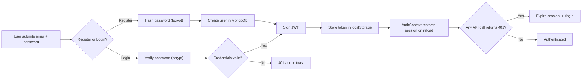
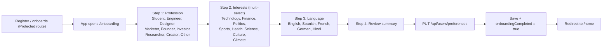
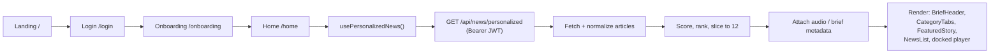
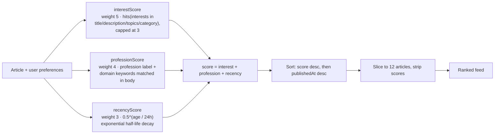
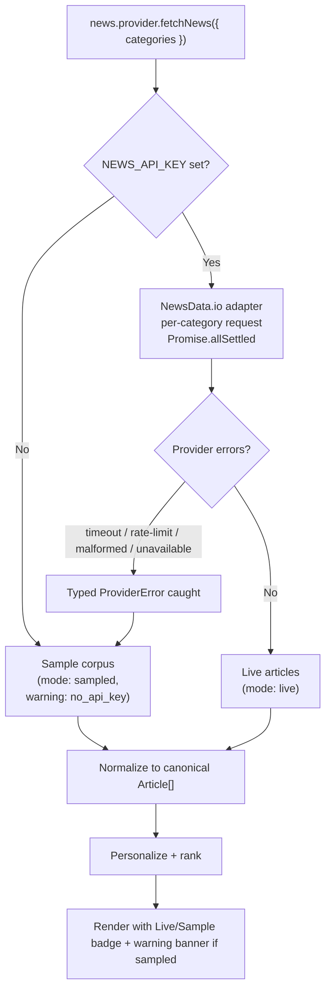
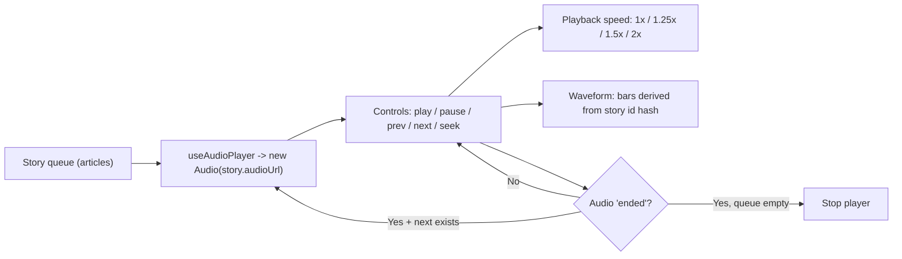
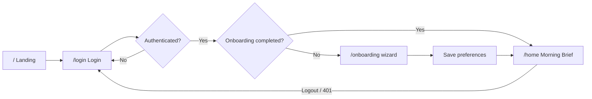

# Nuzio

Nuzio is a personalized audio-first morning news web application for busy Indian professionals and founders. Users sign up, select their profession, interests, and language during onboarding, and every morning receive a "Morning Brief" — a ranked feed of up to 12 stories and a playable audio narration for each. Articles are served through a REST API powered by Express and MongoDB, with a React frontend built on Vite.

| Layer | Technology |
|---|---|
| Frontend | React 19, React Router 7, Vite, Axios |
| Backend | Node.js 20+, Express 5 (ESM) |
| Data | MongoDB (Mongoose) |
| Auth | JWT Bearer tokens + bcrypt password hashing |
| Validation | Zod |
| News feed | NewsData.io (live) with a built-in deterministic sample corpus fallback |

## Features

### 1. Authentication
JWT-based auth with register, login, logout, and session restore. Tokens live in `localStorage`; a `401` on any request expires the session automatically.



### 2. Onboarding wizard
A 4-step wizard that builds the user profile used to personalize the feed: profession, interests, language, then a review step. Saving writes preferences and marks onboarding as completed.



### 3. Personalized Morning Brief
Home renders the ranked feed: a greeting header, category tabs, a featured top story with expanded player, the story list, and a docked mini-player.



### 4. Ranking algorithm
Each article is scored from three weighted signals (internal only — raw scores never reach the client), sorted descending, then trimmed to the personalized limit of 12.



### 5. Live news with graceful degradation
A dispatcher decides the data source. With no API key (or when the live provider fails, times out, or is rate-limited) the app automatically falls back to a 25-story sample corpus — the UI never blanks out.



### 6. Audio player
A single HTML5 `<audio>` element owns the story queue: play/pause, prev/next, seek, playback speed (1×/1.25×/1.5×/2×), deterministic waveform bars, and auto-advance to the next story on end.



## App flow (guards)

Routing guards enforce the user journey: public pages redirect authenticated users, protected pages require a session, and Home additionally requires completed onboarding.



## Project structure

```
nuzio/
│
├── client/                       # React frontend (Vite)
│   └── src/
│       ├── components/           # Presentational components
│       │   ├── ui/               # Reusable UI primitives
│       │   ├── auth/
│       │   ├── onboarding/
│       │   ├── news/
│       │   └── player/
│       ├── pages/                # Route-level components
│       │   ├── Landing/
│       │   ├── Login/
│       │   ├── Onboarding/
│       │   └── Home/
│       ├── features/             # Feature state/logic slices
│       │   ├── auth/
│       │   ├── preferences/
│       │   ├── news/
│       │   └── player/
│       ├── services/             # API client modules
│       │   ├── apiClient.js
│       │   ├── authApi.js
│       │   ├── newsApi.js
│       │   └── preferenceApi.js
│       ├── hooks/
│       ├── routes/
│       ├── utils/
│       ├── App.jsx
│       └── main.jsx
│
├── server/                       # Express REST API
│   └── src/
│       ├── modules/
│       │   ├── auth/             # register / login / logout + JWT
│       │   ├── users/            # user model & profile
│       │   ├── news/             # feed, search, article endpoints, providers, taxonomy, normalizer
│       │   ├── personalization/  # interest/profession/recency scoring & ranking
│       │   ├── brief/            # Morning Brief orchestration
│       │   ├── narration/        # (unwired) Gemini narration
│       │   └── tts/              # (unwired) edge-tts live audio
│       ├── middleware/           # auth, validation, error handling
│       ├── config/
│       ├── utils/
│       ├── app.js
│       └── server.js
│
├── docs/                         # Design & architecture docs
│   ├── PERSONALIZED_NEWS_ARCHITECTURE.md
│   ├── DESIGN_TOKENS.md
│   ├── COMPONENT_SPEC.md
│   ├── RESPONSIVE_SPEC.md
│   └── UI_AUDIT.md
│
├── .env.example
├── .gitignore
└── README.md
```

## Getting started

### Prerequisites

- Node.js 20+
- MongoDB (local or MongoDB Atlas)

### Server

```bash
cd server
npm install
cp ../.env.example .env   # adjust values as needed
npm run dev
```

Runs on `http://localhost:5000`. Health check: `GET /api/health` → `{ "status": "ok" }`.

### Client

```bash
cd client
npm install
cp ../.env.example .env
npm run dev
```

Runs on `http://localhost:5173`. In dev, `/api` requests are proxied to the server.

### Live news (optional)

Add a NewsData.io API key to the server `.env` (`NEWS_API_KEY`) to enable live feeds. Without one, the app serves a deterministic sample corpus with a "Live feeds are off" banner.